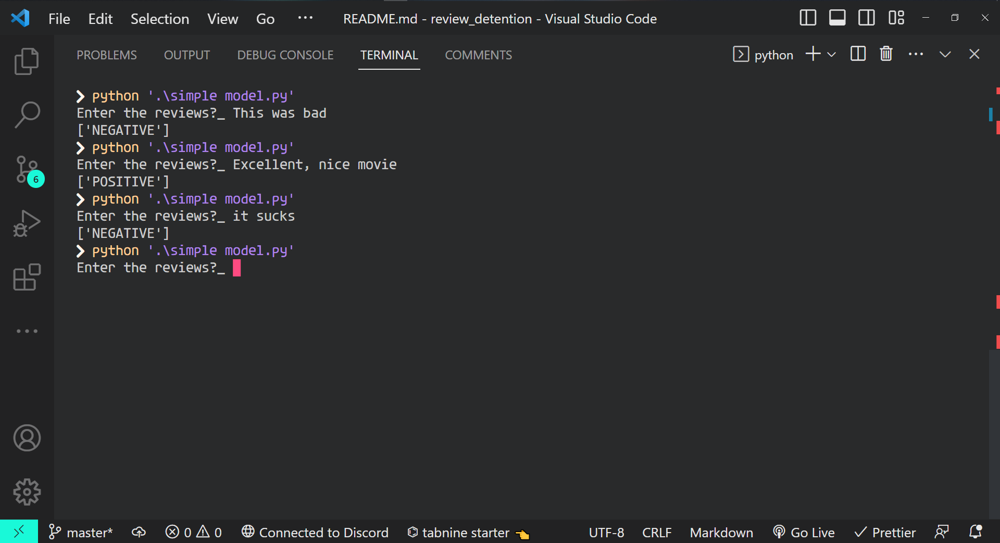

# review-detention-model

A simple python ML model trained with scikit-learn on review datasets to predict if whatever input that is given to it is postive or negative

## Note, it may not produce accurate results due to it having little data of just 1800 to work on

Requirements for this model is to install the sklearn library using
`pip install sklearn`

run the model by running the following command
`python 'simple model.py'`

